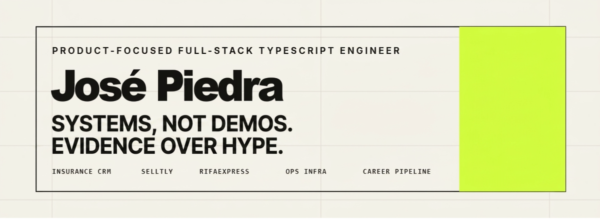

  

# José Piedra

**Product-focused Frontend Engineer / Full-stack TypeScript Engineer**

I build and operate practical software for real business workflows: CRMs, commerce tools, raffle operations, internal systems, product infrastructure, and the tooling that keeps that work understandable, reusable, and honest.

My strength is turning ambiguous operations into usable web products. I usually work frontend-heavy, but I can own the whole product slice: UI, APIs, data modeling, authentication, deployment, documentation, and the tradeoffs that appear when real people depend on the system.

> Systems, not demos. Evidence over hype.

## Current operating systems

| System | What it proves |
| --- | --- |
| **Insurance CRM** | Production CRM for an insurance broker. Replaced spreadsheet-driven operations with client, household, interaction, task, permission, and follow-up workflows. |
| **Selltly** | Active commerce/operations product for small businesses: catalog, inventory, orders, payment-method workflows, tenant/store routing, and market validation. |
| **RifaExpress** | Raffle-management SaaS born from a real client request: raffle administration, ticket flows, public pages, WhatsApp notifications, PostgreSQL, Redis, S3-compatible storage, and VPS deployment. |
| **Churupitos** | Collaborative product migration/restructure around personal finance. Currently MVP/architecture work, not overclaimed as market validation. |
| **Product ops infrastructure** | VPS, homelab, deployment notes, database access, Portainer/WSL workflows, and operational documentation for systems I run or maintain. |
| **Career Pipeline** | Source-of-truth driven resume/application system using Bun, TypeScript, Zod, and Handlebars. It generates ATS-friendly resumes, match reports, gaps, and bilingual outputs without inventing experience. |
| **Portfolio / brand system** | Public technical portfolio and professional evidence layer connected to real product work instead of generic self-promotion. |

## Engineering stance

- Build around real workflows before designing screens.
- Separate shipped, validated, paused, planned, and prototype work.
- Prefer maintainable product architecture over framework noise.
- Work across frontend, backend, data, and infrastructure when the product needs it.
- Use AI as an accelerator for engineering judgment, not as a substitute for it.
- Keep claims traceable to evidence.

## Technical range

| Area | Tools and patterns |
| --- | --- |
| **Frontend product engineering** | Angular, React, Next.js, TypeScript, RxJS, state management, forms, API-backed UI, product workflows |
| **Full-stack TypeScript** | Node.js, NestJS, REST APIs, auth, permissions, PostgreSQL, MongoDB, Redis, business data modeling |
| **Product operations** | CRM workflows, commerce operations, SaaS validation, internal tools, operational documentation |
| **Infrastructure** | VPS deployments, Docker, Nginx, Cloudflare, Dokploy/Portainer-style operations, database access |
| **Career tooling** | Structured resumes, match reports, gap analysis, bilingual outputs, content/render separation |

## Stack

## Contact

- Portfolio: [portfolio.drapie.dev](https://portfolio.drapie.dev)
- LinkedIn: [linkedin.com/in/drapie](https://www.linkedin.com/in/drapie)
- Email: [hello@drapie.dev](mailto:hello@drapie.dev)
